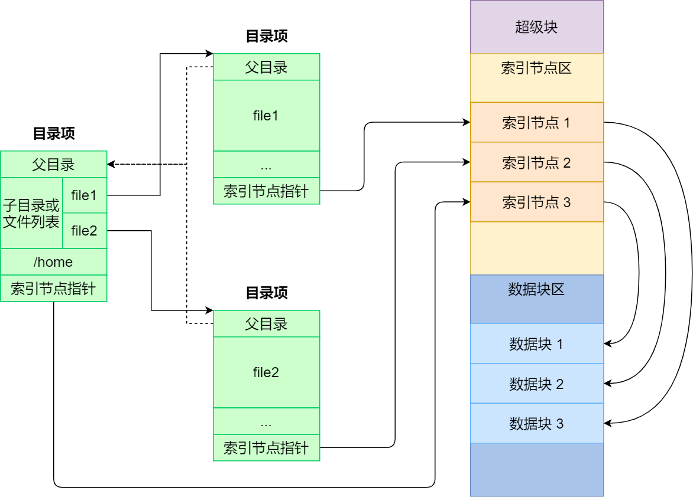

# fs-rs

An easy mixed index file system based on eazy-fs of rcore.

*see the latest in [here](https://github.com/CelestialMelody/fs-rs)*

### Usage

if you don't have rust environment, you can download rust by:

```bash
curl https://sh.rustup.rs -sSf | sh
```

then you can use the following commands to build and run:


```bash
# for the first time
make create

# for the second time or later
make open

# to clean the build
make clean
```

### Features

- read: read a file randomly.
- write: write a file randomly.
- cd: change directory simply.
- ls: list files in current directory.
- mkdir: create a directory.
- touch: create a file.
- rm: remove a file or a directory.
- cat: print the content of a file.
- fmt: format the file system.
- chname: change the name of a file or a directory (a simple version of mv).
- stat: get the size of a file or a directory.(a simple version of ls -l).
- set: a test for file system (copy files form host to easy-fs).
- get: a test for file system (copy files from easy-fs to host).

*maybe more in future*

- mv: move a file or a directory.
- cp: copy a file or a directory.
- pwd: print the current directory.
- find: find a file or a directory.
- ln: create a link.

*If your shell is garbled, it is probably because of the font, and you can modify the icons in the code yourself, or download and use [Hack Nerd Font Mono](https://github.com/ryanoasis/nerd-fonts/blob/master/patched-fonts/Hack/Regular/complete/Hack%20Regular%20Nerd%20Font%20Complete%20Mono.ttf).*



<p style="text-align: right;">image comes from: xiaolincoding</p>
